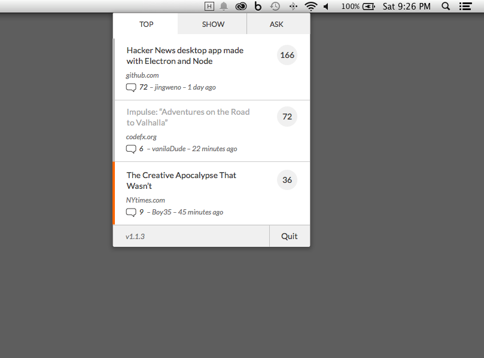

# Hacker Menu

[Hacker Menu](https://hackermenu.io/) stays on your menu bar and delivers the top news stories from [Y Combinator news aggregator](https://news.ycombinator.com/),
built with love by [@jingweno](https://github.com/jingweno) & [@lokywin](https://github.com/lokywin). It's powered by [Electron](http://electron.atom.io/) and [Node.js](https://nodejs.org).

Website: [https://hackermenu.io](https://hackermenu.io).

Screenshot:


## Installation

Download the latest build for your platform from [releases](https://github.com/jingweno/hacker-menu/releases). We only have OSX build now, and we're working Windows and Linux builds. Feel free to contribute if you can't wait :heart:.

## Development

You need to have the latest [io.js](https://iojs.org) or [node.js](https://nodejs.org/) installed.

```bash
$ npm install # installs dependencies
$ npm start # starts the app in the electron wrapper
```

Other useful tasks:

```bash
$ npm test # runs tests
$ npm run build # builds the app
$ npm run watch # watches and rebuilds the app
$ npm run package # packages the Mac app
$ npm run release # packages and zips the Mac app, it requires a cert to sign the app
```

# Roadmap

See [issues](https://github.com/jingweno/hacker-menu/issues?q=is%3Aopen+is%3Aissue+label%3Afeature).


## License

See [LICENSE](https://github.com/jingweno/hacker-menu/blob/master/LICENSE).
